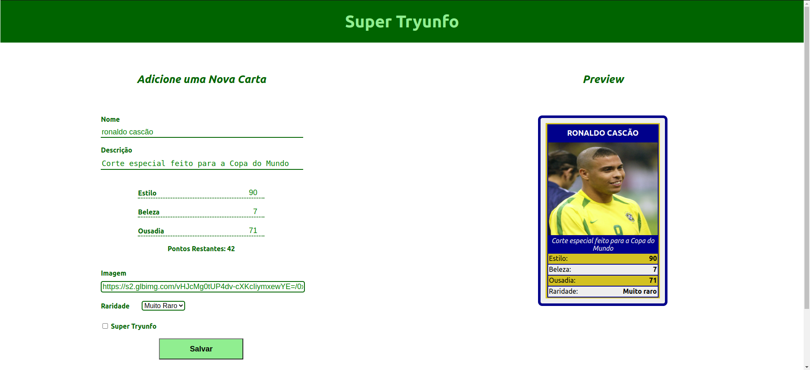
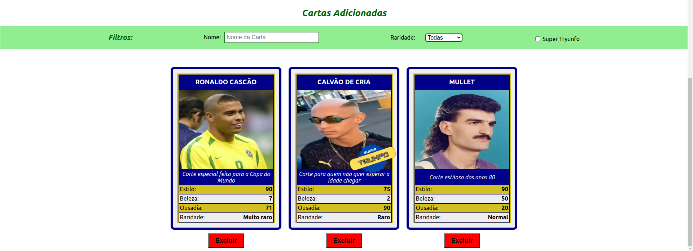

# Projeto Tryunfo - Trybe

Projeto para criação do seu próprio Super Trunfo.

Demonstração de cartas feitas pela aplicação:

## O que foi utilizado?

## Como utilizar?

[Clique aqui para acessar a página do Tryunfo](https://joaopassone.github.io/projetos/tryunfo/index.html)

## Sobre o Super Trunfo

O Super Trunfo é um jogo de cartas que ficou muito popular no Brasil entre as décadas de 80 e 90, mas que faz bastante sucesso até hoje. Suas regras são bastante simples, por isso ele é considerado um jogo fácil de jogar. Apesar de ter regras simples, cada baralho  de Super Trunfo pode ter um tema diferente, o que o torna um jogo bastante divertido.

  Originalmente, o jogo de Super Trunfo é formado por um baralho de 32 cartas. Cada carta representa um item relacionado ao tema do jogo. Em cada carta também existe uma lista com características daquele item e cada característica possui um valor numérico. 

  Para começar o jogo, as cartas devem ser embaralhadas e divididas igualmente para cada participante. Em cada rodada cada pessoa pega somente a primeira carta do seu monte. Na primeira rodada uma pessoa escolhe qual característica quer comparar com as cartas das outras pessoas que estão jogando. Ganha quem tiver o maior número nessa característica. A pessoa que ganhou a rodada recebe as cartas das outras pessoas e escolhe qual característica quer comparar na próxima rodada. O jogo termina quando alguma pessoa tiver todas as cartas do baralho.

  Em cada baralho existe uma (e somente uma) carta Super Trunfo. Essa carta ganha de todas as outras cartas do baralho, independentemente dos valores das características.

  O jogo de Super Trunfo pode ser feito com praticamente qualquer tema, mas tradicionalmente os mais comuns são: carros, países, cidades ou animais.
  
  (Texto retirado do README do projeto original da Trybe)
